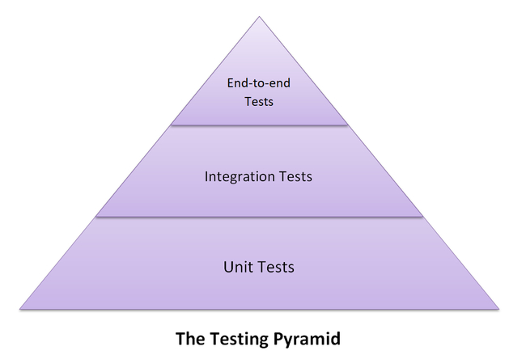

# Automated Software Testing with Pytest
This repository provides an interactive introduction to the [pytest](https://docs.pytest.org/en/7.3.x/index.html) testing framework for Python.

## Installation
The recommended way to install this repo is through git, which can be downloaded 
[here](https://git-scm.com/downloads). Once downloaded, execute the command:

```bash
git clone https://github.com/jstadni2/pytest-fundamentals
```

Next, download the appropriate [Python installer](https://www.python.org/downloads/) for your machine. Make sure to add Python to `PATH`.

Run one of the following commands according to your operating system to install `pytest`.

**macOS:**
```zsh
pip3 install -r requirements.txt
```

**Windows (Powershell):**
```powershell
pip install -r requirements.txt
```

### Visual Studio Code
While not essential for using `pytest`, this repo includes a demonstration of Visual Studio Code integration. The installer can be downloaded [here](https://code.visualstudio.com/download). The [Python extension for Visual Studio Code](https://marketplace.visualstudio.com/items?itemName=ms-python.python) is required to run `pytest` test suites using the GUI.

## What is Software Testing?
* A process of evaluating and verifying whether software meets specified requirements and functions correctly
* Detect bugs before they are encountered by users and ensure software is robust and performant 
* Prevent refactoring or additional features from breaking preexisting functionality (regression)

### Software Testing Pyramid

[source](https://www.meticulous.ai/blog/testing-pyramid-for-frontend)
* **Unit Tests**: test the smallest testable part of the software (eg. a function, method, or class)
* **Integration Tests**: test the interaction between different units or components
* **End-to-End Tests**: test the entire system in a real-world scenario
* As you move up the pyramid:
  * Execution time typically increases
  * Cost to implement/maintain increases

### Why Automated Software Testing?
* Run time-consuming or repetitive tasks more efficiently 
* Repeatable, consistent, and cost-effective
* Allows for more comprehensive testing of edge cases
* Can be integrated into Continuous Integration and Continuous Delivery pipelines (CI/CD)

### Automated Test Steps
1. **Setup**: Initialize data and create the preconditions needed to test specific functionality
2. **Act**: Execute the function or system under test
3. **Assert**: Compare the output or behavior of the software with the expected results
4. **Cleanup**: Tear down test resources or revert state changes to prepare for subsequent tests

## Topics
* [Part 1: `pytest` vs `unittest`](./tests/1_pytest_vs_unittest/README.md)
* [Part 2: Creating Tests](./tests/2_creating_tests/README.md)
* [Part 3: How to Run a Test](./tests/3_running_tests/README.md)
* [Part 4: Visual Studio Code Test Explorer Integration](./tests/4_vs_code_integration/README.md)
* [Part 5: Fixtures](./tests/5_fixtures/README.md)
* [Part 6: Parameterized Tests](./tests/6_parametrized_tests/README.md)
* [Part 7: Expected Exceptions](./tests/7_exceptions/README.md)
